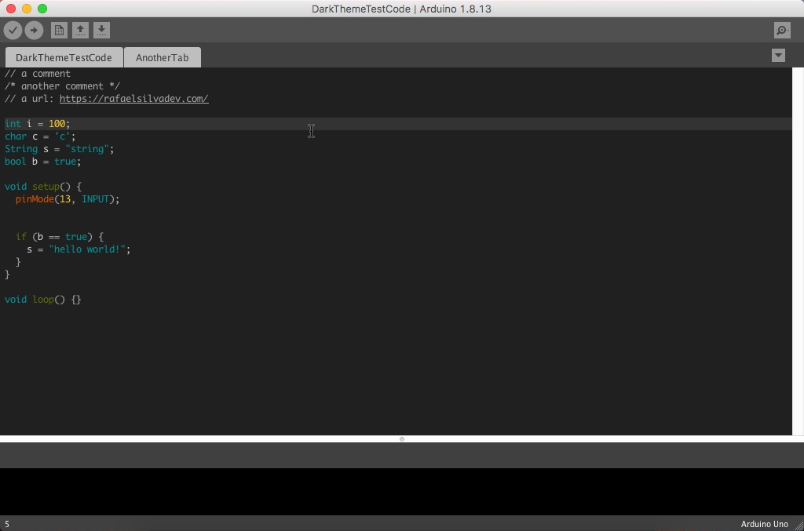
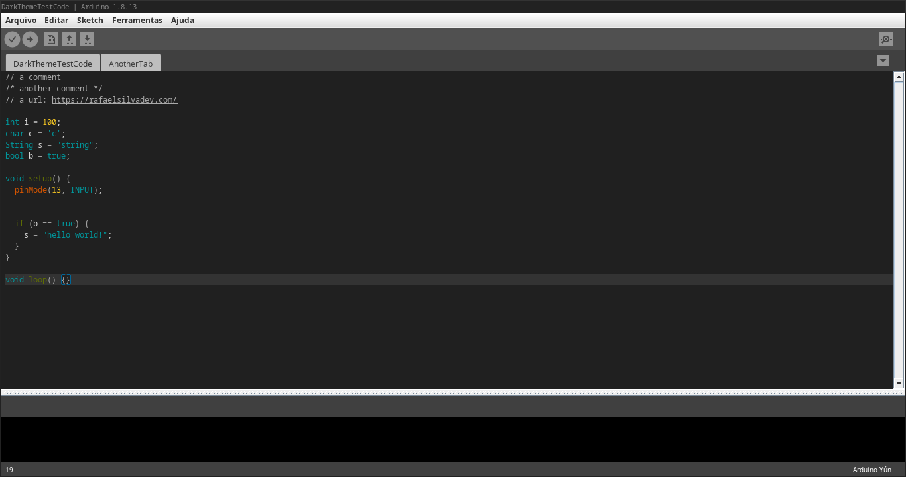

# Nu Dark Arduino Theme

A dark theme for the Arduino IDE - based on [Jeff Thompson's theme](https://github.com/jeffThompson/DarkArduinoTheme)

Works for Arduino version 1.8.13, not tested with newer/older versions.

**Windows10** 

**MacOS** 

**ArchLinux with i3wm** 

### INSTALLATION

* Mac users should look in `/Applications/Arduino.app/Contents/Java/lib` and replace the `theme` folder inside (making a copy of the original in case want to revert back).

* Windows is located in `C:\Program Files (x86)\Arduino\lib`.

* Linux will be in `/usr/share/arduino/lib/` – note you may need to install the Arduino IDE from the Arduino site, not a place like Ubuntu Software.

**OR**

* Download [DarkArduinoTheme.zip](https://github.com/RafaelSilva-RFS/DarkArduinoTheme-Nu/blob/main/DarkArduinoTheme-Nu.zip?raw=true)

* Find your Arduino **Sketchbook location**: Arduino IDE > File > Preferences

> Typically on a **Mac** => `/home/***user***/Arduino`

> Typically on a **Windows** => `%HOMEDRIVE%%HOMEPATH%\Documents\Arduino`

* Go to that location and make new folder **theme**.

* Copy downloaded **DarkArduinoTheme.zip** to theme folder.
  
* Open Arduino IDE > File > Preferences and select DarkArduinoTheme *x.x* on **Theme:** field.

* Restart Arduino IDE.

\-  \-  \-

Released under [MIT license](https://github.com/RafaelSilva-RFS/DarkArduinoTheme-Nu/blob/main/LICENSE) - feel free to use.
